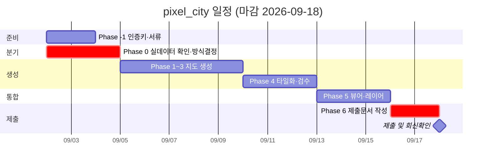
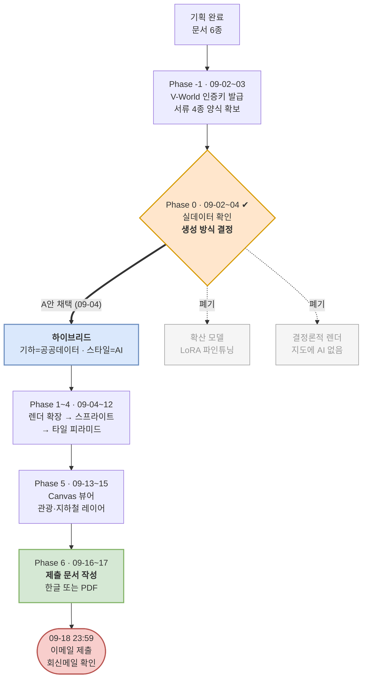
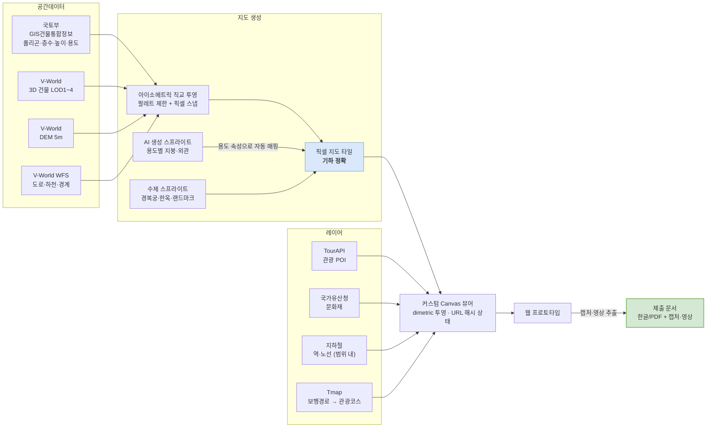
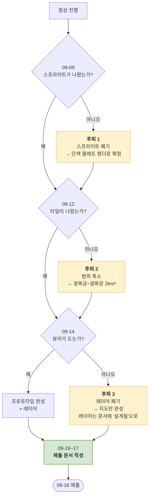

# 전체 흐름

> 흐름도 전용 문서. 마감 2026-09-18.

---

## 1. 일정

```mermaid
gantt
    title pixel_city 일정 (마감 2026-09-18)
    dateFormat YYYY-MM-DD
    axisFormat %m/%d
    todayMarker off

    section 준비
    Phase -1 인증키·서류         :p1, 2026-09-02, 2d

    section 분기
    Phase 0 실데이터 확인·방식결정 :crit, p0, 2026-09-02, 3d

    section 생성
    Phase 1~3 지도 생성          :p2, 2026-09-05, 5d
    Phase 4 타일화·검수          :p3, 2026-09-10, 3d

    section 통합
    Phase 5 뷰어·레이어          :p4, 2026-09-13, 3d

    section 제출
    Phase 6 제출문서 작성        :crit, p5, 2026-09-16, 2d
    제출 및 회신확인             :milestone, 2026-09-18, 0d
```

---

## 2. 단계 흐름과 분기

```mermaid
flowchart TD
    START["기획 완료<br/>문서 6종"] --> P1

    P1["Phase -1 · 09-02~03<br/>V-World 인증키 발급<br/>서류 4종 양식 확보"] --> P0

    P0{"Phase 0 · 09-02~04 ✔<br/>실데이터 확인<br/><b>생성 방식 결정</b>"}

    P0 ==>|"A안 채택 (09-04)"| A["<b>하이브리드</b><br/>기하=공공데이터 · 스타일=AI"]
    P0 -.->|폐기| B["확산 모델<br/>LoRA 파인튜닝"]
    P0 -.->|폐기| C["결정론적 렌더<br/>지도에 AI 없음"]

    A --> MAP

    MAP["Phase 1~4 · 09-04~12<br/>렌더 확장 → 스프라이트<br/>→ 타일 피라미드"] --> VIEW

    VIEW["Phase 5 · 09-13~15<br/>Canvas 뷰어<br/>관광·지하철 레이어"] --> DOC

    DOC["Phase 6 · 09-16~17<br/><b>제출 문서 작성</b><br/>한글 또는 PDF"] --> SUBMIT

    SUBMIT(["09-18 23:59<br/>이메일 제출<br/>회신메일 확인"])

    style P0 fill:#ffe6cc,stroke:#d79b00,stroke-width:2px
    style A fill:#dae8fc,stroke:#6c8ebf,stroke-width:2px
    style B fill:#f5f5f5,stroke:#999,color:#999
    style C fill:#f5f5f5,stroke:#999,color:#999
    style DOC fill:#d5e8d4,stroke:#82b366,stroke-width:2px
    style SUBMIT fill:#f8cecc,stroke:#b85450,stroke-width:2px
```

---

## 3. 데이터 흐름 (A안 기준)

```mermaid
flowchart LR
    subgraph SRC["공간데이터"]
        D1["국토부<br/>GIS건물통합정보<br/>폴리곤·층수·높이·용도"]
        D2["V-World<br/>3D 건물 LOD1~4"]
        D3["V-World<br/>DEM 5m"]
        D4["V-World WFS<br/>도로·하천·경계"]
    end

    subgraph GEN["지도 생성"]
        R["아이소메트릭 직교 투영<br/>팔레트 제한 + 픽셀 스냅"]
        S["AI 생성 스프라이트<br/>용도별 지붕·외관"]
        H["수제 스프라이트<br/>경복궁·한옥·랜드마크"]
        T["픽셀 지도 타일<br/><b>기하 정확</b>"]
    end

    subgraph LAYER["레이어"]
        L1["TourAPI<br/>관광 POI"]
        L2["국가유산청<br/>문화재"]
        L3["지하철<br/>역·노선 (범위 내)"]
        L4["Tmap<br/>보행경로 → 관광코스"]
    end

    V["커스텀 Canvas 뷰어<br/>dimetric 투영 · URL 해시 상태"]
    OUT["웹 프로토타입"]
    DOC["제출 문서<br/>한글/PDF + 캡처·영상"]

    D1 --> R
    D2 --> R
    D3 --> R
    D4 --> R
    R --> T
    S -->|용도 속성으로 자동 매핑| T
    H --> T
    T --> V
    L1 --> V
    L2 --> V
    L3 --> V
    L4 --> V
    V --> OUT
    OUT -->|캡처·영상 추출| DOC

    style T fill:#dae8fc,stroke:#6c8ebf
    style DOC fill:#d5e8d4,stroke:#82b366,stroke-width:2px
```

---

## 4. 후퇴 경로

```mermaid
flowchart TD
    G0["정상 진행"] --> Q1

    Q1{"09-09<br/>스프라이트가 나왔는가?"}
    Q1 -->|예| Q2
    Q1 -->|아니오| F1["<b>후퇴 1</b><br/>스프라이트 폐기<br/>→ 단색 팔레트 렌더로 확정"]
    F1 --> Q2

    Q2{"09-12<br/>타일이 나왔는가?"}
    Q2 -->|예| Q3
    Q2 -->|아니오| F2["<b>후퇴 2</b><br/>범위 축소<br/>→ 경복궁~광화문 2km²"]
    F2 --> Q3

    Q3{"09-14<br/>뷰어가 도는가?"}
    Q3 -->|예| OK["프로토타입 완성<br/>+ 레이어"]
    Q3 -->|아니오| F3["<b>후퇴 3</b><br/>레이어 폐기<br/>→ 지도만 완성<br/>레이어는 문서에 '설계됨'으로"]

    OK --> DOC
    F3 --> DOC
    DOC["09-16~17<br/><b>제출 문서 작성</b>"] --> SUB(["09-18 제출"])

    style F1 fill:#fff2cc,stroke:#d6b656
    style F2 fill:#fff2cc,stroke:#d6b656
    style F3 fill:#fff2cc,stroke:#d6b656
    style DOC fill:#d5e8d4,stroke:#82b366,stroke-width:2px
```
