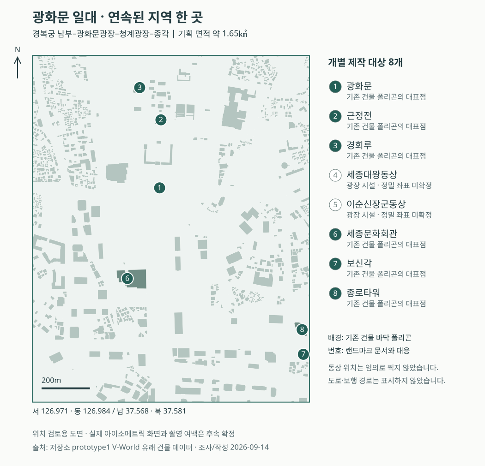
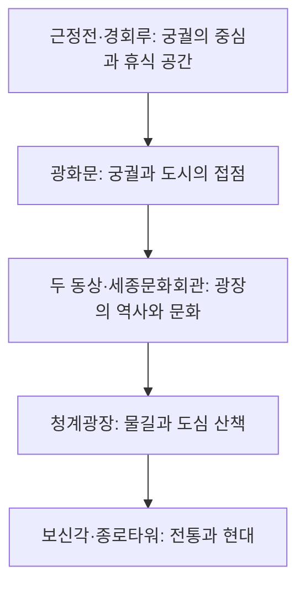

# 서울 도심 소구역 선정·기획 조사

조사·합의일: **2026-09-14** · 용도: 내부 기획 및 후속 작업 인계

이 문서는 사용자와 합의한 **지역·랜드마크·환경 표현 방향**을 기록한다. 코드 구현, 새 지도 생성,
API 연동이 완료되었다는 뜻은 아니다. 구현 현황은 조사 시점의 커밋 `e897aa3`와
[Prototype2 GUIDE](../../prototype2/docs/GUIDE.md)를 기준으로 한다. 동시에 진행 중인 미커밋 확장 작업은 평가하지 않았다.

관련 문서: [랜드마크 8개와 참고자료](landmarks.md) · [실제 시간·날씨 표현](environment.md)

## 1. 합의한 방향

**서울의 지금을 픽셀로 산책하는 지도.**

| 결정 | 합의 내용 |
|---|---|
| 주 구현 기반 | Prototype2를 메인으로 사용하고 Prototype1의 공간데이터·규칙 기반 접근을 필요한 부분에 도입 |
| 지역 선정 기준 | 서울의 대표성과 관광 서사 우선 |
| 공간 구성 | 떨어진 장면 여러 개가 아닌 연속된 지역 한 곳 |
| 선정 지역 | 경복궁 남부–광화문광장–청계광장–종각 |
| 개별 제작 | 건축물 6개와 동상 2개, 총 8개 랜드마크 |
| 일반 건물 | 배경 이미지로 묶어 제작·검수 비용 절감 |
| 기본 상호작용 | 독립 외형, 장소 선택·정보, 주변 산책 |
| 환경 표현 | 서울의 실제 시간·날씨를 반영한 빛·그림자·비·눈·적설 |
| 이번 작업 | 조사·문서·범위도 작성. 실행 코드 및 생성 에셋 제작은 후속 작업 |

낮·노을·밤, 강수와 적설은 앞으로 구현할 제품 목표다. 랜드마크를 숨기거나 이동·회전시키는
편집 기능은 이번 기획의 우선 기능이 아니다. 야간 조명은 환경 변화의 일부로 다룬다.

## 2. 폴더 구조와 재사용 가능한 자산

```text
pixel_city/
├── docs/
│   ├── DEVELOPMENT.md       개발·검증 진입 안내
│   ├── design/             데스크톱·모바일 UI 참고 시안
│   └── planning/           이번 기획·조사 자료
├── prototype1/
│   ├── docs/               초기 기획, 방식 비교, 연구·작업 이력
│   ├── poc/                수집, 규칙 렌더, 지형·지붕색, 사진 스프라이트 시험
│   └── web/                Canvas 뷰어와 건물·도로·지형·POI 데이터
└── prototype2/
    ├── inputs/snapshot/    Prototype1에서 분리한 고정 입력
    ├── configs/            장면·생성·검수 설정
    ├── scripts/            캡처, 이미지 생성, 합성·검증 도구
    ├── assets/             저장소에 포함된 재질 및 객체 데모
    ├── eval/, work/        실험 결과·중간 자료; 일부는 로컬에만 존재
    ├── web/pilot/          현재 지도 탐색·상호작용 실험 화면
    ├── tests/              기존 기능 검증
    └── docs/, PLAN.md      최신 실험 안내와 진행 이력
```

### 확인한 사실

- Prototype1 건물 데이터는 **6,991동**이다. 건물 폴리곤·높이와 용도·구조·연도·지붕색 등의 속성이 있다.
- Prototype2의 고정 건물 스냅샷도 6,991동이지만 필드는 `n/uses/kind/use/h/rings/names`다.
  Prototype1의 최신 속성 및 높이가 모두 동기화된 상태로 간주하면 안 된다.
- Prototype1의 `poc/landmark.py`는 국가유산 사진의 하늘 제거·축소·팔레트 변환 실험이다.
  AI로 모든 랜드마크를 개별 생성하는 코드가 아니다.
- Prototype2의 기존 객체 데모는 18개 건물을 분리했고, 대표 건물 3채의 AI 후보 중 윤곽 기준을
  통과한 것은 1개로 기록되어 있다. 이 수치는 해당 시험 결과이며 일반적인 성공률 추정에 사용하지 않는다.
- 이전 남산 시험은 완성 그림에서 타워 픽셀을 분리하고 뒤쪽 배경을 AI로 보완했다.
  최신 정사영 산책 시험은 배경 속 타워의 선택 윤곽을 표시한다. 두 방식을 혼동하지 않는다.
- 시간대·비 버튼은 기준 커밋에서 준비 중 상태다. 실제 보행 경로 정합과 전체 이미지 구조도 검증 완료로 기록되지 않았다.

근거: [개발 안내](../DEVELOPMENT.md), [P1 데이터](../../prototype1/web/data/city.json),
[P2 스냅샷](../../prototype2/inputs/snapshot/city.json), [P1 랜드마크 도구](../../prototype1/poc/landmark.py),
[P2 진행 상태](../../prototype2/PLAN.md), [P2 GUIDE](../../prototype2/docs/GUIDE.md).

### 제안하는 역할 분담

Prototype2의 배경과 화면을 중심으로 하되, Prototype1의 건물 위치·높이·도로·지형은 위치 확인과
효과용 보조 자료로 활용한다. **개별 건물을 AI로 생성하지 않는 것과 건물의 공간정보를 버리는 것은 다르다.**
다만 생성 이미지의 건물과 데이터 좌표가 어긋날 수 있으므로, 속성을 가져오는 것만으로 그림자·적설 영역이
정확해지는 것은 아니다. 실제 영상과의 정합 검토가 선행되어야 한다.

## 3. 후보 지역 비교

아래 적합성 판단은 관광지 순위나 방문객 통계가 아니라, 현재 프로젝트의 데이터·제작 방식에 대한 기획 판단이다.

| 후보 | 장점 | 제작상 부담 | 판단 |
|---|---|---|---|
| **경복궁 남부–광화문–종각** | 궁궐·광장·문화시설·현대 건축이 한 지역에 연결 | 궁궐의 실제 배치, 작은 동상, 높은 종로타워의 가림 검수 | **선정**: 대표성과 관광 서사를 우선한 사용자 선택 |
| 덕수궁–시청–정동 일부 | 궁궐과 근대·현대 건축, 기존 생성 결과 활용 | 기존 그림의 재해석 부분 확인, 정동을 넓히면 기존 경계 밖 추가 자료 필요 | 작은 범위의 완성도 중심 대안 |
| 남산 정상 | 상징적인 타워, 숲·경사·산책·가림 표현 | 넓은 숲과 지형, 보행·표고 정합, 도시 명소 밀도는 상대적으로 낮음 | 후속 지형 확장 후보 |
| 동대문–DDP | 전통 성문과 독특한 현대 건축의 대비 | 기존 수집 범위 밖, 별도 공간데이터·원본 확보 필요 | 후속 신규 지역 후보 |

경복궁의 광화문–근정전 축은 궁궐의 핵심 공간이며, 광화문광장은 동상·월대와 주변 관광자원을
연결할 수 있는 역사문화 공간이다. 이 사실을 바탕으로 선정 지역의 관광 서사를 구성한다.
[국가유산포털 경복궁 소개](https://heritage.go.kr/heri/html/HtmlPage.do?pg=%2Fpalaces%2FpalacesRoyalInfo.jsp),
[서울시 광화문광장](https://gwanghwamun.seoul.go.kr/ghm/contents/3.do?mid=1024)

정동의 역사 건축·문화시설은 [서울관광재단 정동길 안내](https://english.visitseoul.net/attractions/Jeongdong-gil/ENP000889),
남산의 상징성과 관광 기능은 [N서울타워 공식 소개](https://www.nseoultower.co.kr/global/intro.asp),
DDP의 특징은 [한국관광공사 소개](https://korean.visitkorea.or.kr/detail/rem_detail.do?cotid=242ab80d-67e1-4dc8-a07a-4667955c2e59)를 참고했다.
오래된 자료는 건축·지역 특성 파악에만 사용하며 현재 운영시간의 근거로 사용하지 않는다.

## 4. 기획 경계와 범위도

| 항목 | 값 |
|---|---|
| 서 / 동 경도 | 126.971 / 126.984 |
| 남 / 북 위도 | 37.568 / 37.581 |
| 좌표 순서 | `[west, south, east, north]` = `[126.971, 37.568, 126.984, 37.581]` |
| 동서 × 남북 길이 | 약 1.15 × 1.44km |
| 직사각형 면적 | 약 **1.65㎢** |
| 기존 수집 경계 면적 | 약 7.86㎢; 선정 경계는 약 **21%** |
| 포함 건물 수 | **1,015동**, 아래 계산 방식의 대표점 기준 |

북쪽은 근정전·경회루를 포함한 경복궁 남부, 중심은 광화문과 광장, 남쪽은 청계광장과 청계천 시작 구간,
동쪽은 보신각·종로타워다. 경복궁 북부·북촌·남산은 이번 제작 범위로 포함하지 않는다.



[원본 범위도 열기](seoul-pilot-scope.svg). 북쪽이 위인 위치 검토용 도면이며 완성 픽셀 지도의 카메라 화면이 아니다.
점 번호는 [랜드마크 표](landmarks.md)의 번호다. 동상 2개는 시설 존재를 확인했지만 정밀 좌표를 확보하지 않아
위치 점으로 그리지 않았다. 관광 동선이나 통행 가능 경로를 나타내는 선은 넣지 않았다.

### 수치의 재현 방법과 한계

입력은 `prototype1/web/data/meta.json`과 `city.json`이다. 폴리곤의 첫 좌표에 이후 좌표 쌍을 누적하여
delta encoding을 해제하고, `q=10`으로 나눠 로컬 미터 좌표를 구한다. 위경도 환산은 다음과 같다.

```text
lon = origin.lon0 + e / origin.mlon
lat = origin.lat0 + n / origin.mlat
width_m  = (east - west) * origin.mlon
height_m = (north - south) * origin.mlat
area_km2 = width_m * height_m / 1,000,000
```

건물 수는 각 ring 정점의 산술평균을 대표점으로 사용하여 경계 안에 있는 건물을 센 값이다.
닫힘 정점이 저장되어 있으면 평균에 포함한다. 면적 가중 중심점이나 경계와 교차하는 모든 건물을 센 값은 아니다.
기존 데이터 총 6,991동에는 경계와 걸치거나 바깥으로 연장되는 건물이 있어 경계 내부 대표점 수와 다를 수 있다.
면적은 행정구역 면적이 아닌 로컬 좌표계의 직사각형 근삿값이다.

**이 경계는 기획 범위다.** 종로타워 등 동쪽 경계 가까운 건물의 전체 실루엣·그림자, 궁궐 담장과 도로의
연속성을 확보하려면 촬영·렌더링 시 경계 밖 여백을 확보해야 한다. 타일 수·최종 해상도·생성 비용은 확정하지 않았다.
기존 남산 한 장의 비용을 면적에 비례시켜 이번 예산으로 제시하지 않는다.

## 5. 관광 경험의 구성

다음 순서는 서사를 설명하는 **탐방 구상**이며 검증된 보행 경로가 아니다.



궁궐 내부와 외부는 출입구·관람 조건이 다르다. 후속 코스 작성 시 실제 출입구·보도·횡단보도와
관람 가능 구간을 확인한다. 현재 예시 캐릭터 경로를 실제 관광 길찾기로 승격하지 않는다.

기본 경험은 지도 탐색 → 랜드마크 선택 → 짧은 장소 이야기 → 주변을 살펴보는 흐름이다.
서울의 현재 환경은 이 흐름의 분위기를 바꾼다. 추천 코스 자동 생성이나 방문 인증·사진 업로드는 별도 기획으로 남긴다.

## 6. 인계 및 문서 검수

- [x] 지역·연속성·랜드마크 8개·실제 환경 반영에 대한 사용자 선택 기록
- [x] 커밋된 구현과 향후 목표 구분
- [x] 기획 경계, 계산 방식, 건물 대표점 수 및 범위도 작성
- [x] 공식 기관·설계사·프로젝트 제작자의 참고 링크와 확인일 기록
- [x] 로컬 문서 링크·코드 블록·SVG 형식·면적 및 1,015동 집계 검증
- [x] 범위도 브라우저 렌더링 및 글자 경계 검사, 캡처 시각 검수 완료
- [ ] 동상 2개 정밀 좌표, 궁궐 출입구와 실제 코스 확인 — 후속 자료 확보
- [ ] 생성 입력용 사진별 이용조건·카메라 적합성 확인 — 참고 페이지 열람과 별개
- [ ] 최종 촬영 여백·해상도·검수량·예산 산정 — 구현 착수 시 결정

링크와 이미지 제공 방식은 바뀔 수 있다. 아래 및 관련 두 문서의 웹 자료 확인일은 모두 **2026-09-14**다.
국가유산포털 일부 페이지는 검색 결과로 내용을 확인했으나 직접 본문 열람에서 403이 발생했다.
이미지·도면 원본을 내려받았거나 생성 입력 사용을 승인받았다는 뜻은 아니다.

이번 검수는 문서와 범위도에 대한 것이다. 앱 기능 테스트나 인증 기상 API 호출은 실행하지 않았다.
